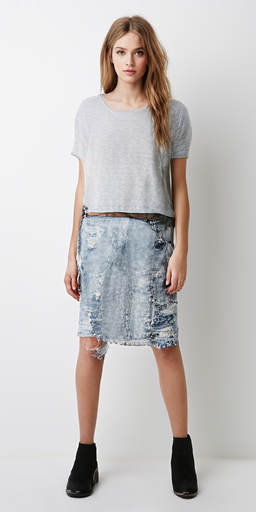
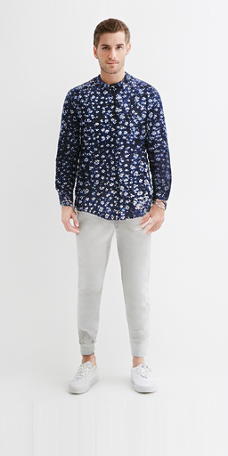
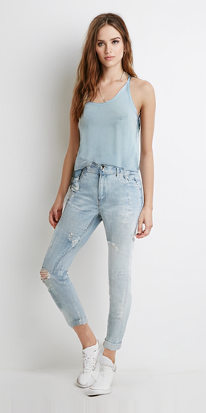
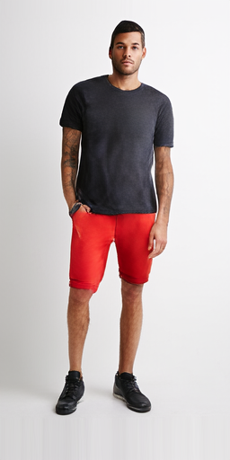
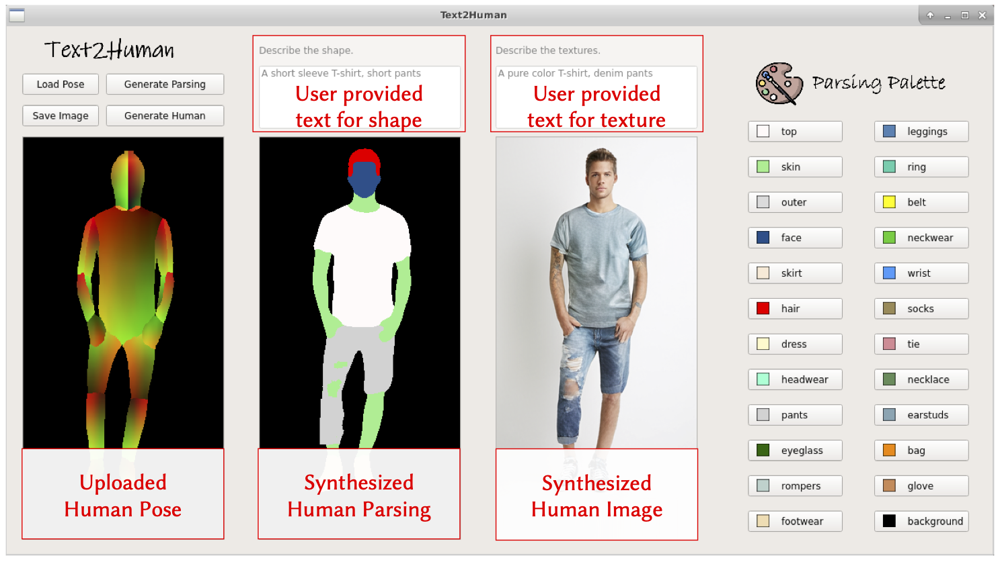
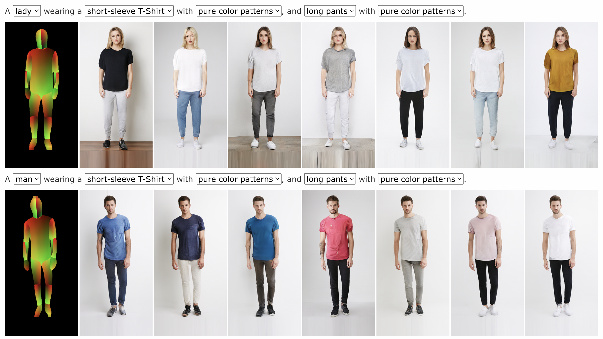
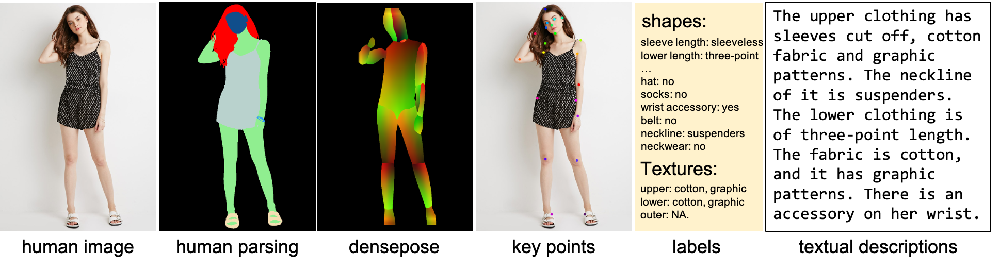

# Text2Human - Official PyTorch Implementation

<!--  -->

This repository provides the official PyTorch implementation for the following paper:

**Text2Human: Text-Driven Controllable Human Image Generation**</br>
[Yuming Jiang](https://yumingj.github.io/), [Shuai Yang](https://williamyang1991.github.io/), [Haonan Qiu](http://haonanqiu.com/), [Wayne Wu](https://dblp.org/pid/50/8731.html), [Chen Change Loy](https://www.mmlab-ntu.com/person/ccloy/) and [Ziwei Liu](https://liuziwei7.github.io/)</br>
In ACM Transactions on Graphics (Proceedings of SIGGRAPH), 2022.

From [MMLab@NTU](https://www.mmlab-ntu.com/index.html) affliated with S-Lab, Nanyang Technological University and SenseTime Research.

<table>
<tr>
    <td></td>
    <td></td>
    <td></td>
    <td></td>
</tr>
<tr>
    <td align='center' width='24%'>The lady wears a short-sleeve T-shirt with pure color pattern, and a short and denim skirt.</td>
    <td align='center' width='24%'>The man wears a long and floral shirt, and long pants with the pure color pattern.</td>
    <td align='center' width='24%'>A lady is wearing a sleeveless pure-color shirt and long jeans</td>
    <td align='center' width='24%'>The man wears a short-sleeve T-shirt with the pure color pattern and a short pants with the pure color pattern.</td>
<tr>
</table>

[**[Project Page]**](https://yumingj.github.io/projects/Text2Human.html) | [**[Paper]**](https://arxiv.org/pdf/2205.15996.pdf) | [**[Dataset]**](https://github.com/yumingj/DeepFashion-MultiModal) | [**[Demo Video]**](https://youtu.be/yKh4VORA_E0)


## Updates

- [05/2022] Paper and demo video are released.
- [05/2022] Code is released.
- [05/2022] This website is created.

## Installation
**Clone this repo:**
```bash
git clone https://github.com/yumingj/Text2Human.git
cd Text2Human
```
**Dependencies:**

All dependencies for defining the environment are provided in `environment/text2human_env.yaml`.
We recommend using [Anaconda](https://docs.anaconda.com/anaconda/install/) to manage the python environment:
```bash
conda env create -f ./environment/text2human_env.yaml
conda activate text2human
conda install -c huggingface tokenizers=0.9.4
conda install -c huggingface transformers=4.0.0
conda install -c conda-forge sentence-transformers=2.0.0
```

If it doesn't work, you may need to install the following packages on your own:
  - Python 3.6
  - PyTorch 1.7.1
  - CUDA 10.1
  - [sentence-transformers](https://huggingface.co/sentence-transformers) 2.0.0
  - [tokenizers](https://pypi.org/project/tokenizers/) 0.9.4
  - [transformers](https://huggingface.co/docs/transformers/installation) 4.0.0

## (1) Dataset Preparation

In this work, we contribute a large-scale high-quality dataset with rich multi-modal annotations named [DeepFashion-MultiModal](https://github.com/yumingj/DeepFashion-MultiModal) Dataset.
Here we pre-processed the raw annotations of the original dataset for the task of text-driven controllable human image generation. The pre-processing pipeline consists of:
  - align the human body in the center of the images according to the human pose
  - fuse the clothing color and clothing fabric annotations into one texture annotation
  - do some annotation cleaning and image filtering
  - split the whole dataset into the training set and testing set

You can download our processed dataset from this [Google Drive](https://drive.google.com/file/d/1KIoFfRZNQVn6RV_wTxG2wZmY8f2T_84B/view?usp=sharing). If you want to access the raw annotations, please refer to the [DeepFashion-MultiModal](https://github.com/yumingj/DeepFashion-MultiModal) Dataset.

After downloading the dataset, unzip the file and put them under the dataset folder with the following structure:
```
./datasets
├── train_images
    ├── xxx.png
    ...
    ├── xxx.png
    └── xxx.png
├── test_images
    % the same structure as in train_images
├── densepose
    % the same structure as in train_images
├── segm
    % the same structure as in train_images
├── shape_ann
    ├── test_ann_file.txt
    ├── train_ann_file.txt
    └── val_ann_file.txt
└── texture_ann
    ├── test
        ├── lower_fused.txt
        ├── outer_fused.txt
        └── upper_fused.txt
    ├── train
        % the same files as in test
    └── val
        % the same files as in test
```

## (2) Sampling

### Inference Notebook
</a></br>
Coming soon.


### Pretrained Models

Pretrained models can be downloaded from this [Google Drive](https://drive.google.com/file/d/1VyI8_AbPwAUaZJPaPba8zxsFIWumlDen/view?usp=sharing). Unzip the file and put them under the dataset folder with the following structure:
```
pretrained_models
├── index_pred_net.pth
├── parsing_gen.pth
├── parsing_token.pth
├── sampler.pth
├── vqvae_bottom.pth
└── vqvae_top.pth
```

### Generation from Paring Maps
You can generate images from given parsing maps and pre-defined texture annotations:
```python
python sample_from_parsing.py -opt ./configs/sample_from_parsing.yml
```
The results are saved in the folder `./results/sampling_from_parsing`.

### Generation from Poses
You can generate images from given human poses and pre-defined clothing shape and texture annotations:
```python
python sample_from_pose.py -opt ./configs/sample_from_pose.yml
```

**Remarks**: The above two scripts generate images without language interactions. If you want to generate images using texts, you can use the notebook or our user interface.

### User Interface

```python
python ui_demo.py
```


The descriptions for shapes should follow the following format:
```
<gender>, <sleeve length>, <length of lower clothing>, <outer clothing type>, <other accessories1>, ...

Note: The outer clothing type and accessories can be omitted.

Examples:
man, sleeveless T-shirt, long pants
woman, short-sleeve T-shirt, short jeans
```

The descriptions for textures should follow the following format:
```
<upper clothing texture>, <lower clothing texture>, <outer clothing texture>

Note: Currently, we only support 5 types of textures, i.e., pure color, stripe/spline, plaid/lattice, 
    floral, denim. Your inputs should be restricted to these textures.
```

## (3) Training Text2Human

### Stage I: Pose to Parsing
Train the parsing generation network. If you want to skip the training of this network, you can download our pretrained model from [here](https://drive.google.com/file/d/1MNyFLGqIQcOMg_HhgwCmKqdwfQSjeg_6/view?usp=sharing).
```python
python train_parsing_gen.py -opt ./configs/parsing_gen.yml
```

### Stage II: Parsing to Human

**Step 1: Train the top level of the hierarchical VQVAE.**
We provide our pretrained model [here](https://drive.google.com/file/d/1TwypUg85gPFJtMwBLUjVS66FKR3oaTz8/view?usp=sharing). This model is trained by:
```python
python train_vqvae.py -opt ./configs/vqvae_top.yml
```

**Step 2: Train the bottom level of the hierarchical VQVAE.**
We provide our pretrained model [here](https://drive.google.com/file/d/15hzbY-RG-ILgzUqqGC0qMzlS4OayPdRH/view?usp=sharing). This model is trained by:
```python
python train_vqvae.py -opt ./configs/vqvae_bottom.yml
```

**Stage 3 & 4: Train the sampler with mixture-of-experts.** To train the sampler, we first need to train a model to tokenize the parsing maps. You can access our pretrained parsing maps [here](https://drive.google.com/file/d/1GLHoOeCP6sMao1-R63ahJMJF7-J00uir/view?usp=sharing).
```python
python train_parsing_token.py -opt ./configs/parsing_token.yml
```

With the parsing tokenization model, the sampler is trained by:
```python
python train_sampler.py -opt ./configs/sampler.yml
```
Our pretrained sampler is provided [here](https://drive.google.com/file/d/1OQO_kG2fK7eKiG1VJH1OL782X71UQAmS/view?usp=sharing).

**Stage 5: Train the index prediction network.**
We provide our pretrained index prediction network [here](https://drive.google.com/file/d/1rqhkQD-JGd7YBeIfDvMV-vjfbNHpIhYm/view?usp=sharing). It is trained by:
```python
python train_index_prediction.py -opt ./configs/index_pred_net.yml
```


**Remarks**: In the config files, we use the path to our models as the required pretrained models. If you want to train the models from scratch, please replace the path to your own one. We set the numbers of the training epochs as large numbers and you can choose the best epoch for each model. For your reference, our pretrained parsing generation network is trained for 50 epochs, top-level VQVAE is trained for 135 epochs, bottom-level VQVAE is trained for 70 epochs, parsing tokenization network is trained for 20 epochs, sampler is trained for 95 epochs, and the index prediction network is trained for 70 epochs.

## (4) Results

Please visit our [Project Page](https://yumingj.github.io/projects/Text2Human.html#results) to view more results.</br>
You can select the attribtues to customize the desired human images.
[
](https://yumingj.github.io/projects/Text2Human.html#results)

## DeepFashion-MultiModal Dataset


In this work, we also propose **DeepFashion-MultiModal**, a large-scale high-quality human dataset with rich multi-modal annotations. It has the following properties:
1. It contains 44,096 high-resolution human images, including 12,701 full body human images.
2. For each full body images, we **manually annotate** the human parsing labels of 24 classes.
3. For each full body images, we **manually annotate** the keypoints.
4. We extract DensePose for each human image.
5. Each image is **manually annotated** with attributes for both clothes shapes and textures.
6. We provide a textual description for each image.



Please refer to [this repo](https://github.com/yumingj/DeepFashion-MultiModal) for more details about our proposed dataset.

## TODO List

- [ ] Release 1024x512 version of Text2Human.
- [ ] Train the Text2Human using [SHHQ dataset](https://stylegan-human.github.io/).

## Citation

If you find this work useful for your research, please consider citing our paper:

```bibtex
@article{jiang2022text2human,
  title={Text2Human: Text-Driven Controllable Human Image Generation},
  author={Jiang, Yuming and Yang, Shuai and Qiu, Haonan and Wu, Wayne and Loy, Chen Change and Liu, Ziwei},
  journal={ACM Transactions on Graphics (TOG)},
  volume={41},
  number={4},
  articleno={162},
  pages={1--11},
  year={2022},
  publisher={ACM New York, NY, USA},
  doi={10.1145/3528223.3530104},
}
```

## Acknowledgments

Part of the code is borrowed from [unleashing-transformers](https://github.com/samb-t/unleashing-transformers), [taming-transformers](https://github.com/CompVis/taming-transformers) and [mmsegmentation](https://github.com/open-mmlab/mmsegmentation).
